# What's that?
OpenMoM is an attempt to rewrite from scratch a port of Master Of Magic game from Microprose.

The aim of the project is accuracy and extensibility: everything should be as much similar to the original game but at the same time the design should allow to easily tweak or extend the mechanics of the game itself.

# How is it written?

The engine is written in C++14 and SDL2.0 is used for graphics, window management and controls.

The graphics engine is written to ease the management of the low level profile graphics of the original game. Everything is palette based and drawing is made by using an approach which probably resembles the one used originally for the game. While this implies that everything is quite low level, this really helps in mimicking the original behavior of most effects and animations. This also makes the grapichs quite abstract from the effective graphics framework as long as it is able to draw a texture.

# Philosophy

While it might seems quite obsessive the first and more important thing is being similar to the original game in the first place. Every animation, font, colors, placement, should be as similar as possible to the original game. This doesn't mean that the game itself shouldn't be enhanced but that it should be possible to play it also as if it were the original game.

The implementation, though, should be extensible and well designed, especially regarding game data and behavior of things like spells, combat, AI.

# Running

The code compiles on macOS with the provided XCode project, on Windows with the provided VS2017 project and on Debian Linux supposedly (through CMake). You need to copy all the original LBX files from the game into `data/lbx` to run the game.

The XCode and VS2017 projects also provide a LBX manager target which is used to see all the data inside LBX files and mark it as used.

On Windows you need to put your SDL2 libraries and includes inside `libs/sdl2/win` folder. Includes should go inside `libs/sdl2/win/include` while libs should go inside `libs/sdl2/win/lib/x64/` (or `x86`) folder. Don't forget to put `SDL2_Image` too which is required to compile.

# Current status

Master of Magic is a game of incredible complexity, each single and minor aspect is full of quirks and special considerations that have been made during the original development. Tthis probably means that a lot of spaghetti code was involved in the original game, which makes reproducing the structure while updating the design to something more manageable and extensible quite a challenging task.

Much work have been done on the overall structure of the game, management for units, armies, cities, combat, spells is already present but at a prototype stage. The graphics engine already supports almost all the feature required by the original game, LBX support is almost done and bugless and allows to use original graphics without much effort.

Many attempts of writing a remake of Master of Magic have been made and just a few reached the playable stage, since this is a hobby project done on my free time I'm more focused on the entertainment given by designing a flexible architecture.

Given that anyone willing to contribute is welcome and I can provide any insight on the structure of the engine to get up running.

# Current screenshots

These screenshots are generated automatically for each view of the game, they don't respect the realtime status since, for example, intro view requires some timing to actually show something but they're here to showcase the status:

main view

city view

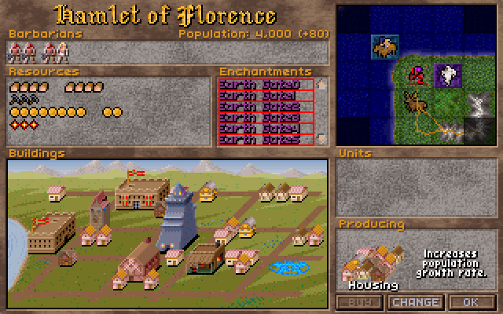

combat view

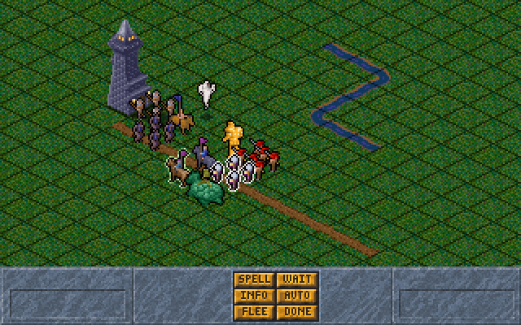

unit view

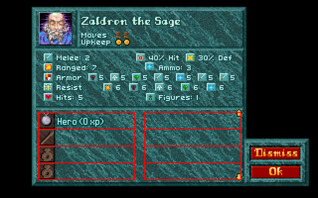

spellbook view

magic view

research view

alchemy view

armies view

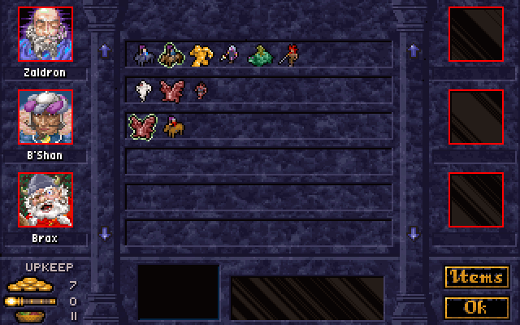

armies-items view

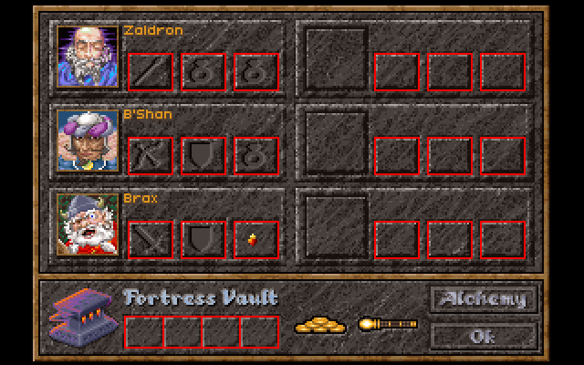

item-craft view

item-craft-charges view

merchant view

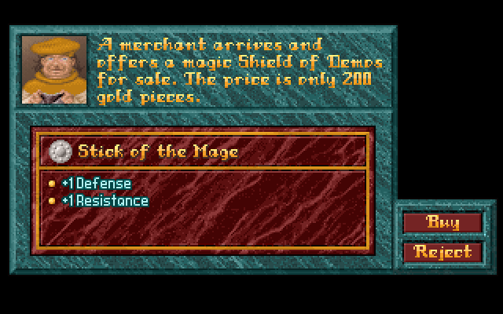

army view

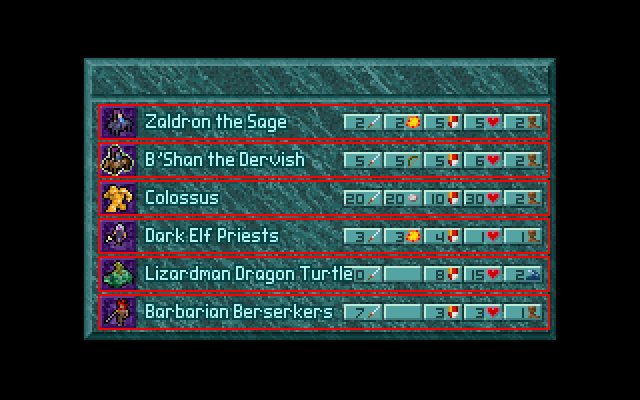

message view

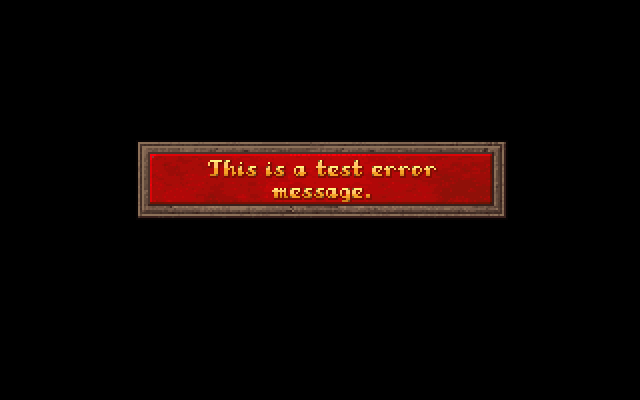

cities view

mirror view

info-menu view

cartographer view

diplomacy view

astrologer view

historian view

production view

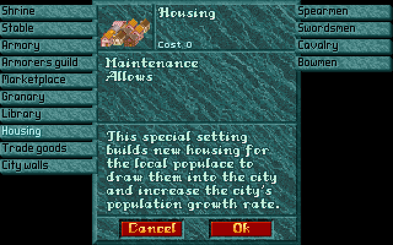

outpost view

new-game view

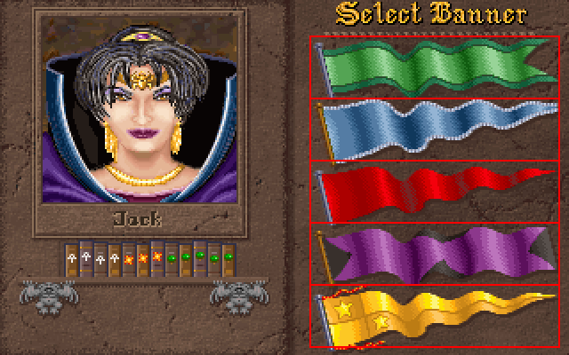

load view

options view

start view

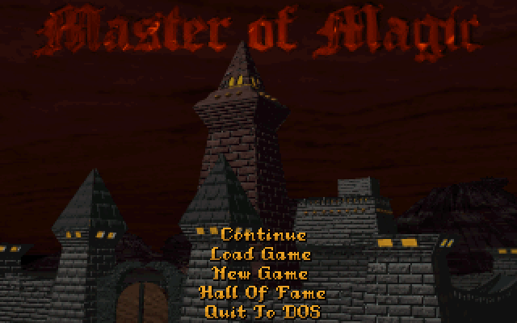

intro view

    
